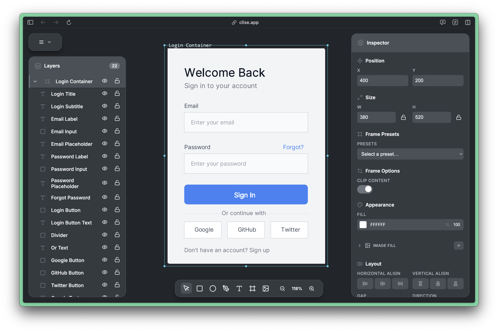

# Clise

<div align="center">
  
  <p>A high-performance design canvas built with React and CanvasKit-WASM</p>
</div>

[](https://opensource.org/licenses/MIT)
[](https://www.typescriptlang.org/)
[](https://reactjs.org/)

A modern design canvas that delivers 60fps performance with 1000+ elements. Built with React 19, TypeScript, and Google's CanvasKit-WASM.

## Features

- **Design Tools**: Rectangle, ellipse, text, frame, and path tools
- **Advanced Styling**: Gradients, shadows, blur effects, and stroke styles
- **60fps Performance**: Smooth rendering with 1000+ elements
- **Smart Caching**: Optimized memory usage and resource pooling
- **Keyboard Shortcuts**: Power-user friendly shortcuts
- **Multi-language Support**: EN, FR, PT

## Quick Start

```bash
# Clone and setup
git clone https://github.com/clise-app/clise.git
cd clise
pnpm install

# Start development
pnpm dev
```

Open `http://localhost:5173` in your browser.

## Usage

| Tool      | Shortcut | Description                    |
| --------- | -------- | ------------------------------ |
| Select    | `V`      | Select and manipulate elements |
| Rectangle | `R`      | Draw rectangles                |
| Ellipse   | `E`      | Draw circles and ovals         |
| Frame     | `F`      | Create container frames        |
| Text      | `T`      | Add text elements              |

### Key Shortcuts

- `Ctrl/Cmd + A` - Select all
- `Ctrl/Cmd + C/V` - Copy/paste
- `Ctrl/Cmd + D` - Duplicate
- `Delete` - Delete selected
- `Ctrl/Cmd + 0` - Reset zoom

## Architecture

**Technologies**: React 19, TypeScript, CanvasKit-WASM, Jotai, Vite

**Performance Optimizations**:

- Paint Pooling (60-80% fewer allocations)
- Smart Caching (filters, paths, colors)
- View Culling (skip off-screen elements)

```
src/
├── canvas/          # Rendering system
├── components/      # UI components
├── panels/         # App panels
├── store/          # State (Jotai atoms)
└── utils/          # Utilities
```

## Documentation

- [Architecture Guide](docs/ARCHITECTURE.md) - System design
- [Performance Guide](docs/PERFORMANCE_OPTIMIZATIONS.md) - Optimization strategies
- [Contributing Guide](CONTRIBUTING.md) - How to contribute

## Contributing

1. Fork and clone the repository
2. Create a feature branch: `git checkout -b feature/name`
3. Make changes and add tests
4. Submit a pull request

See [CONTRIBUTING.md](CONTRIBUTING.md) for detailed guidelines.

## License

MIT - see [LICENSE](LICENSE) file.

## Acknowledgments

Thanks to Google Skia, React, Jotai, and Vite teams for the amazing libraries that power Clise.
